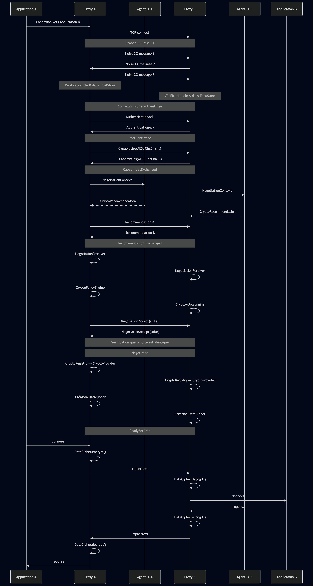

#+title: Workflow

* Workflow
** Overview

** Control plane
#+begin_src emacs-lisp
                  CONTROL PLANE

Proxy A                                  Proxy B
   │                                        │
   ├──────── TCP connection ───────────────►│
   │                                        │
   │◄────────── Noise XX ──────────────────►│
   │                                        │
   │        AuthenticatedConnection         │
   │                                        │
   ├──────── AuthenticationAck ────────────►│
   │◄─────── AuthenticationAck ─────────────┤
   │                                        │
   ├──────── Capabilities ─────────────────►│
   │◄─────── Capabilities ──────────────────┤
   │                                        │
   │              AI                        │
   ▼                                        ▼
CryptoAdvisor                         CryptoAdvisor
   │                                        │
   ▼                                        ▼
Recommendation                       Recommendation
   │                                        │
   ├──────── Recommendation ───────────────►│
   │◄─────── Recommendation ────────────────┤
   │                                        │
   ▼                                        ▼
NegotiationResolver                  NegotiationResolver
   │                                        │
   ▼                                        ▼
CryptoPolicyEngine                   CryptoPolicyEngine
   │                                        │
   ├──── NegotiationAccept(suite) ─────────►│
   │◄─── NegotiationAccept(suite) ──────────┤
   │                                        │
   └──────────── NEGOTIATED ────────────────┘
#+end_src
** Data plane
#+begin_src emacs-lisp
                    DATA PLANE

Application A                         Application B
     │                                     ▲
     │ plaintext                           │ plaintext
     ▼                                     │
┌──────────────┐                       ┌──────────────┐
│   Proxy A    │                       │   Proxy B    │
│              │                       │              │
│ DataCipher   │                       │ DataCipher   │
│  encrypt     │                       │  decrypt     │
└──────┬───────┘                       └──────▲───────┘
       │                                      │
       │       encrypted application data     │
       └─────────────────────────────────────►│

Application A                         Application B
       ▲                                     │
       │ plaintext                           │ plaintext
       │                                     ▼
┌──────┴───────┐                       ┌──────────────┐
│   Proxy A    │                       │   Proxy B    │
│              │                       │              │
│ DataCipher   │                       │ DataCipher   │
│  decrypt     │                       │  encrypt     │
└──────▲───────┘                       └──────┬───────┘
       │                                      │
       │       encrypted application data     │
       │◄─────────────────────────────────────┘
#+end_src
** Side car
#+begin_src emacs-lisp
┌─────────────────────────────────────────────────────────┐
│                     AI SOCKS SIDECAR                    │
│                                                         │
│  ┌───────────────────────────────────────────────────┐  │
│  │                 SOCKS FRONTEND                    │  │
│  │          connexion de l'application               │  │
│  └───────────────────────┬───────────────────────────┘  │
│                          │                              │
│  ┌───────────────────────▼───────────────────────────┐  │
│  │                  PeerSession                      │  │
│  │                                                   │  │
│  │ Authenticated                                     │  │
│  │      ↓                                            │  │
│  │ PeerConfirmed                                     │  │
│  │      ↓                                            │  │
│  │ CapabilitiesExchanged                             │  │
│  │      ↓                                            │  │
│  │ RecommendationsExchanged                          │  │
│  │      ↓                                            │  │
│  │ Negotiated                                        │  │
│  │      ↓                                            │  │
│  │ ReadyForData                                      │  │
│  └───────────────────────┬───────────────────────────┘  │
│                          │                              │
│          ┌───────────────┴────────────────┐             │
│          │                                │             │
│          ▼                                ▼             │
│  ┌───────────────┐               ┌─────────────────┐    │
│  │ CONTROL PLANE │               │   DATA PLANE    │    │
│  │               │               │                 │    │
│  │ CryptoAdvisor │               │ CryptoRegistry  │    │
│  │      │        │               │       │         │    │
│  │      ▼        │               │       ▼         │    │
│  │ Rig / LLM     │               │ CryptoProvider  │    │
│  │      │        │               │       │         │    │
│  │      ▼        │               │       ▼         │    │
│  │ Recommendation│               │ DataCipher      │    │
│  │      │        │               │                 │    │
│  │      ▼        │               │ encrypt/decrypt │    │
│  │ Resolver      │               └─────────────────┘    │
│  │      │        │                                      │
│  │      ▼        │                                      │
│  │ PolicyEngine  │                                      │
│  └───────────────┘                                      │
│                                                         │
│  ┌──────────────────────────────────────────────────┐   │
│  │          AuthenticatedConnection                 │   │
│  │                                                  │   │
│  │ AuthenticatedPeer                                │   │
│  │ SecureChannel / Noise                            │   │
│  │ FramedIo                                         │   │
│  │ TcpStream                                        │   │
│  └─────────────────────────┬────────────────────────┘   │
└────────────────────────────┼─────────────────────────-──┘
                             │
                             ▼
                           NETWORK
#+end_src
* Summary
** Final Workflow
#+begin_src emacs-lisp
Application A
     │
     │ SOCKS
     ▼
Proxy A
     │
     │ TCP
     ▼
Proxy B
     │
     │
     ├── 1. Noise XX
     │
     ├── 2. TrustStore
     │
     ├── 3. AuthenticationAck
     │
     ├── 4. Capabilities
     │
     ├── 5. CryptoAdvisor / Rig
     │
     ├── 6. Recommendations
     │
     ├── 7. NegotiationResolver
     │
     ├── 8. CryptoPolicyEngine
     │
     ├── 9. NegotiationAccept
     │
     ├── 10. CryptoRegistry
     │
     ├── 11. DataCipher
     │
     ▼
ReadyForData
     │
     │ encrypted application stream
     ▼
Proxy B
     │
     │ plaintext
     ▼
Application B
#+end_src
** Architecture
#+begin_src emacs-lisp
              ┌─────────────────────────┐
              │       CONTROL PLANE     │
              │                         │
              │ Noise authentication    │
              │ Capabilities            │
              │ Rig / AI                │
              │ Negotiation             │
              │ Policy                  │
              └────────────┬────────────┘
                           │
                    selected suite
                           │
                           ▼
              ┌─────────────────────────┐
              │        DATA PLANE       │
              │                         │
Application ─►│ Proxy → DataCipher ─────┼──► Proxy → Application
              │                         │
              └─────────────────────────┘
#+end_src
